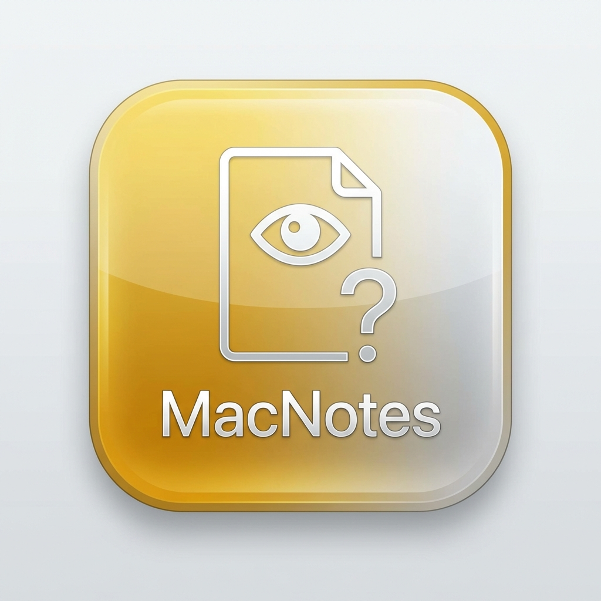

# 📝 MacNotes

> A premium, Apple-inspired note-taking app with cloud sync, built with Next.js 16 and MongoDB.



## ✨ Features

- **🔐 Authentication** - Secure login/register with email & password
- **📁 Folders** - Organize notes into custom folders with colors
- **🏷️ Tags** - Add tags to notes for quick filtering
- **📌 Pin Notes** - Keep important notes at the top
- **📦 Archive** - Archive notes you don't need right now
- **🗑️ Trash** - Soft delete with restore capability
- **📝 Rich Text Editor** - Bold, italic, headings, lists, code blocks, and more
- **🔍 Advanced Search** - Search by title, content, or tags
- **☁️ Cloud Sync** - Real-time sync across devices
- **🌓 Dark Mode** - Light, dark, and system theme options
- **📱 PWA Support** - Install as a native app on mobile/desktop
- **🎨 Premium Design** - Clean, minimal, Apple-inspired UI

## 🚀 Tech Stack

- **Framework**: Next.js 16 (App Router)
- **Language**: 100% TypeScript
- **Database**: MongoDB with Mongoose
- **Auth**: NextAuth.js
- **Styling**: Tailwind CSS 4
- **Editor**: Tiptap
- **PWA**: @ducanh2912/next-pwa

## 📦 Installation

```bash
# Clone the repository
git clone https://github.com/yourusername/macnote.git
cd macnote

# Install dependencies
npm install

# Set up environment variables
cp .env.example .env.local
# Edit .env.local with your MongoDB URI and NextAuth secret

# Run development server
npm run dev
```

## ⚙️ Environment Variables

Create a `.env.local` file with:

```env
MONGODB_URI=your_mongodb_connection_string
NEXTAUTH_SECRET=your_secret_key
NEXTAUTH_URL=http://localhost:3000
```

## 🌐 Deployment

### Vercel (Recommended)

1. Push your code to GitHub
2. Import project to [Vercel](https://vercel.com)
3. Add environment variables in Vercel dashboard
4. Deploy!

## 📸 Screenshots

| Light Mode | Dark Mode |
|------------|-----------|
|  |  |

## 📄 License

MIT License - feel free to use this project for personal or commercial purposes.

## 🤝 Contributing

Contributions are welcome! Please feel free to submit a Pull Request.

---

Made with ❤️ using Next.js and MongoDB
